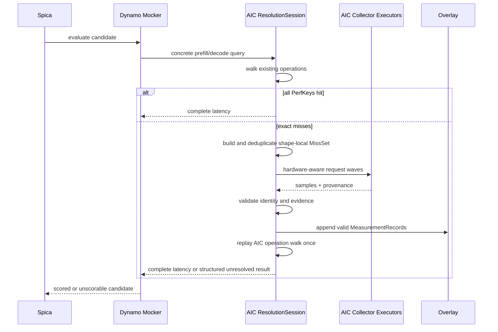

# Dynamic Lazy Performance Collection for AIConfigurator

**Status:** Approved design

**Date:** 2026-07-06

**Scope:** AIConfigurator (AIC), with the first end-to-end integration through Dynamo Mocker and Spica

## Decision summary

AIC will gain an explicit, opt-in **measure-on-miss resolution session**. When Dynamo Mocker asks AIC for the latency of one concrete prefill or decode shape, AIC walks the same existing operations it already uses for prediction. If every exact performance key is present, it returns normally. If keys are missing, AIC collects all unique misses visible in that operation walk, schedules their microbenchmarks across the available GPU and fabric topology, appends validated results to a persistent overlay, reruns only the AIC operation walk, and returns a complete latency.

The cost is paid once per unique unresolved performance key, not once per Mocker iteration. Repeated shapes, repeated layers, later candidates, and compatible later runs reuse the same evidence.

This imports Rhino's most useful pattern—runtime-shaped, cache-backed, on-demand profiling—without importing Rhino's graph runtime or adding a new AIC graph IR. V1 reuses AIC's existing operations, composites, perf schemas, and collector implementations.

## Source baseline and provenance

This design was developed against the following local revisions:

- AIC local checkout: `ffbab15797d3a3f14c382e937c0ab0c1c5cbc530`
- AIC fetched `upstream/main`: `0828d6b7e4a7880079443b1c6f9c148d85bdbf54`
- Dynamo local checkout: `5d3bb78df771246cf6909cb2a3d1852920afb9b6`
- Rhino local checkout: `c63f24b99e4ad1e9eb72820bee59bac7e8544b83`

The local AIC checkout is 52 commits behind `upstream/main`. Core AIC operation/database/collector seams cited below exist in the local checkout; Spica is cited from the fetched upstream tree (`docs/spica/`, `src/spica/`). Implementation should start from a branch containing the upstream Spica code or explicitly port the integration; it must not assume this local checkout already contains `src/spica`.

### Existing AIC seams

- `src/aiconfigurator/sdk/backends/base_backend.py:248` and `:289` walk `model.context_ops` and `model.generation_ops`, passing concrete scalar runtime fields to `Operation.query`.
- `src/aiconfigurator/sdk/operations/base.py:114` defines the operation contract.
- `src/aiconfigurator/sdk/operations/overlap.py:124` and its fallback implementation show that AIC already supports nested composites without a general DAG.
- `src/aiconfigurator/sdk/operations/communication.py:60`, `:242`, and `:437` model custom all-reduce, NCCL, and point-to-point communication as operations.
- `src/aiconfigurator/sdk/perf_database.py:119` exposes `PerfDataNotAvailableError`; `:1135` defines `PerfDatabase`; `:1553` already treats missing data as a structured caller-visible signal.
- `collector/registry_types.py:82` defines `OpEntry` with `get_func`, `run_func`, `perf_filename`, and module/version routing.
- `collector/collect.py:972` resolves collection entries; `:1033` imports registered functions; `:1056` invokes the current case generator and runner path.

### Existing Mocker and Spica seams

- Dynamo `lib/mocker/src/common/perf_model.rs:30` defines the direct `AicCallback` for prefill and decode.
- `lib/mocker/src/common/perf_model.rs:220` passes Mocker's prefill/decode scalar shape descriptors to AIC.
- AIC upstream `docs/spica/overview.md` and `src/spica/evaluator.py` establish that Spica owns candidate search while Dynamo Replay/Mocker owns system scheduling and candidate scoring.

### Rhino patterns retained

- `crates/rhino-graph/src/profile_key.rs:4` uses structured workload keys for reusable timing evidence.
- `crates/rhino-search/src/profile.rs:1500` profiles only adaptive misses after calibration, and the cache accounting around `:1570` avoids repeated work.
- `crates/rhino-search/src/runner.rs:225` maintains full/component/timing caches across search candidates.

Rhino's executable `ShadowGraph`, graph-diff search, PDL/launch-block semantics, and runtime dependency are intentionally not adopted in V1.

## Goals

1. Resolve missing exact AIC performance points lazily from real Mocker callback shapes.
2. Preserve ordinary AIC prediction as fast, deterministic, GPU-free, and side-effect-free by default.
3. Reuse AIC's current operation lists, composites, perf schemas, collector registry, and collector functions.
4. Deduplicate measurements within a callback and reuse evidence across callbacks, candidates, and compatible runs.
5. Use available GPUs and fabric efficiently while preserving timing isolation.
6. Support single- and multi-GPU operations, including communication collectors whose identity depends on world size and topology.
7. Keep every search result auditable: exact evidence, provenance, collection overhead, and unresolved reasons.

## Non-goals for V1

- Discovering new graph partitions, fusions, or overlap semantics.
- Introducing a canonical AIC subgraph language or executable graph IR.
- Depending on Rhino at runtime or extracting a shared Rhino/AIC profiling core.
- Capturing or persisting runtime tensor payloads.
- Coordinating multiple independent resolution services as a distributed system.
- Automatically promoting on-demand measurements into released curated perf databases.
- Hiding unresolved points behind empirical predictions in measure-on-miss mode.

## Terminology

### PerfKey

A stable structured identity for one reusable performance point. Its authoritative query fields come from the operation's existing perf-data schema; a serialized string or hash is only an encoding.

### MeasurementRequest

An ephemeral reproducible work order for one absent `PerfKey`: registered collector, exact case inputs, deterministic input recipe, resource requirements, measurement protocol, and any collector-owned tuning policy. It never contains captured tensors.

### MissSet

The temporary per-callback map from unique `PerfKey` to its `MeasurementRequest` and all operation consumers. It deduplicates physical measurement while retaining runtime multiplicity.

### MeasurementRecord

An append-only observation produced by one request: key, samples, selected statistic, units, status, optional winning tuned implementation/configuration, and hardware/software/collector provenance. Only a valid compatible record satisfies future queries.

### ResolutionSession

The explicit policy and resource context that permits AIC to turn a miss into GPU work. It spans a Mocker/Spica search so worker runtimes, communicators, caches, budgets, and reporting can be reused.

## Architecture and ownership

- **Spica** owns deployment-candidate enumeration and search policy.
- **Mocker** owns request arrival, scheduling, queues, KV state, routing, and the causal sequence of concrete prefill/decode callbacks.
- **AIC** owns operation expansion, exact performance identity, layered lookup, miss planning, collection policy, result validation, persistence, and complete latency return.
- **AIC collector executors** mechanically acquire evidence on their assigned hardware resources.

Mocker selects an AIC resolution policy but never selects or invokes an individual collector. AIC is the only component that joins prediction with collection.



Mocker advances simulated time only after the current callback receives complete latency. There is no candidate-wide dry replay and no placeholder latency used to discover future shapes.

## Concrete shape propagation

The existing Python backend already passes fields such as `batch_size`, `x`, sequence length, and prefix into the operation walk. The direct Mocker callback currently carries reduced scalar descriptors:

- prefill: `(batch_size, effective_isl, prefix)`
- decode: `(batch_size, isl, osl)`

The lazy path must preserve these concrete callback fields through normalization and into each operation's `PerfKey` and collector case. It must not reconstruct an exact request shape from AIC's aggregate Rust FPM features. In particular, `rust/aiconfigurator-core/src/fpm/model.rs:76` documents aggregate scheduled-work features, and `:516` reduces a rank's workload to token/request sums.

V1 uses concrete shape, dtype/layout, and existing operation/configuration parameters. Value-sensitive operations may add a small, operation-defined semantic fingerprint (for example, an MoE load-distribution bucket). The collector deterministically synthesizes tensors from the key and fingerprint. Runtime tensor capture is out of scope.

## Mocker and Spica bridge contract

V1 uses Dynamo's direct Python-backed `AicCallback` path, because that path already carries Mocker's concrete callback descriptor into the existing Python AIC operation walk and collector registry. The aggregate native Rust FPM remains useful for forward-pass prediction and telemetry correction, but it is not treated as an exact per-operation collection request.

The current Rust `AicCallback` methods return a bare `f64`. Measure-on-miss requires the bridge to propagate a structured success or failure (for example, a `Result<f64, AicResolutionError>`-equivalent contract or a Python exception envelope that Replay converts into an infeasible candidate). A collector failure must never be coerced into zero latency, a negative value, or an empirical estimate.

Collection may block one latency callback for seconds or minutes. The Python/Rust bridge must not hold the PyO3 GIL or a Mocker scheduler lock while waiting on collector executors. The callback remains causally synchronous from Mocker's perspective, while the actual hardware work runs in executor processes or otherwise outside those locks.

Spica may evaluate candidates in a process pool. Every cold `ResolutionSession` requires an exclusive resource lease. Therefore:

- parallel evaluators are allowed when each receives a disjoint GPU/fabric lease;
- otherwise measure-on-miss evaluation is serialized (`parallel_evals=1`) while the callback-local wave scheduler uses the full assigned lease;
- independent evaluators must not point at the same unleased timing devices;
- once a coverage preflight proves the relevant evidence is warm, ordinary read-only scoring may use the existing parallel path. Any evaluator that may still collect requires its own lease.

V1 does not require an IPC profiling service shared by all Spica workers. Such a service is a possible later optimization, not an implicit dependency of the design.

## PerfKey and overlay identity

`PerfKey` is the product of four namespaces:

1. **Dataset identity:** operation, backend, collector adapter, and perf-schema version.
2. **Existing query fields:** the exact dimensions, dtype/layout, and operation/configuration knobs already used by that perf lookup.
3. **Environment compatibility:** GPU/system class, runtime and kernel build compatibility, and any resource-topology identity required by the operation.
4. **Optional semantic fingerprint:** absent by default and explicitly defined only by value-sensitive operations.

For communication and multi-GPU operations, world size and an abstract topology class are part of the key and provenance. Physical GPU IDs should not unnecessarily prevent reuse; incompatible topology classes must.

Lookup order is:

1. in-memory exact-key index;
2. persistent on-demand overlay;
3. curated perf database;
4. structured miss.

The overlay is append-only. For multiple exact compatible records, the latest valid committed record by a monotonic append sequence wins deterministically while older observations remain auditable. Wall-clock timestamps alone do not define precedence. Rejected and failed attempts may be retained for diagnostics but are never indexed as hits. Promotion into curated data is a separate validation/export action.

Measurement-protocol revision (warmup/sample/statistic rules) and collector tuning-policy/search-space revision participate in record compatibility and selection even when they are not operation-level perf dimensions. A policy may deliberately accept older compatible protocols; that decision is recorded in the session manifest.

## Measurement objects and multiplicity

Consider two repeated layers with the same missing GEMM key:

```text
layer.0.qkv -> key G -> miss
layer.1.qkv -> key G -> miss
output_proj -> key O -> miss
```

The `MissSet` contains one request for `G` with two consumers and one request for `O`. The collector measures `G` once. On the replayed operation walk, the recorded latency for `G` contributes once for each layer consumer.

The three names describe semantic roles, not a required class hierarchy. A minimal implementation may represent the `MissSet` as a map whose value contains a request plus consumer references, and may represent `MeasurementRecord` directly as the overlay row.

## Callback-local resolution state machine

The warm path remains the current lookup path:

```text
Mocker callback -> AIC operation walk -> all keys hit -> return latency
```

The cold path is:

```text
discover -> reconcile -> resolve -> commit -> requery once
```

1. Walk every contributing operation and collect all unique misses; do not stop at the first miss.
2. Recheck the overlay to close races and reconcile each key with coordinator-local in-flight work.
3. Join an existing future for a matching key or claim ownership of a new request.
4. Schedule new requests in hardware-aware, non-conflicting waves.
5. Validate results, append each valid record atomically, and refresh the exact-key index.
6. Replay the AIC operation walk once.
7. Return complete latency. A remaining miss is an invariant failure, not an implicit second collection loop.

Single-flight is guaranteed within one `ResolutionSession` coordinator. Process-safe append/index operations protect the overlay. Valid partial results survive if another request in the same wave fails, so later callbacks reuse completed work; the candidate still remains unscorable until every required key resolves. V1 does not add a distributed coordinator for independent sessions; the resource allocator must not assign overlapping timing resources to independent active sessions.

## Hardware-aware collection scheduler

Global serial execution would waste available hardware. Global unconstrained parallel execution would contaminate timings. The scheduler therefore maximizes **safe** parallelism: requests run concurrently only when their allocated devices and declared contention domains do not overlap.

Each lazy-enabled collector exposes a `ResourceContract` equivalent to:

```text
kind: compute | collective | composite
gpu_count: 1 | N
topology: any | nvlink-clique | nvswitch | nic-local | operation-specific
exclusive_domains: device, nvlink-domain, pcie-root, nic, node
runtime/backend requirements
memory estimate
optional communicator identity
```

At session startup, AIC inventories the assigned resource pool: GPU class and memory, peer links, NVLink/NVSwitch domains, PCIe roots, and NIC locality. A greedy wave planner builds a conflict graph and packs a large non-conflicting set of requests per wave.

Examples:

- Independent single-GPU compute requests may occupy every available GPU concurrently.
- A four-GPU collective reserves its device clique and declared fabric domain while work may continue on a truly independent domain.
- A node-spanning or multi-node collective reserves all devices and fabric/NIC domains it requires.
- A collector may conservatively request node exclusivity when interference behavior is unknown.

Persistent executors amortize initialization. Compute executors may be cached per GPU/runtime; collective executors may cache communicators by compatible device group, topology, world size, and runtime. Batching means deduplicated scheduling and shared executor lifetime, not co-running conflicting timing kernels.

Parallel collection is an orchestration optimization only. Timings from independent jobs running in the same wave are stored as independent records and are not interpreted as a newly measured overlap/fusion. AIC's existing `OverlapOp` or other composite remains responsible for runtime composition unless that composite has its own explicit collector adapter.

A single coordinator may manage multi-process/rank workers over its assigned resource pool. What is deferred is coordination among multiple independent resolution coordinators, not multi-GPU measurement itself.

## Reusing the current collector registry

Offline and lazy collection converge on the same normalized collector-case representation:

```text
offline: YAML case plan -> expand -> exact collector cases
lazy: MeasurementRequest -> case_from_query -> exact collector cases
```

`CollectorCase` is conceptual and may remain the dict/tuple form an existing collector consumes.

The current `OpEntry` fields remain authoritative. Lazy support is opt-in per operation through small additions equivalent to:

- `case_from_query(normalized_kwargs)`;
- `resource_contract(case)` or a static resource contract;
- optional semantic-fingerprint-to-input-generator parameters;
- perf-schema and adapter revision.

Both sources use the same registered `get_func`/`run_func` code. A persistent executor may submit several cases together when supported or loop through them without recreating its runtime.

If the existing collector internally autotunes several kernel implementations/configurations for one exact case, the lazy request invokes that same tuning path. The record stores the selected winner and enough tuning-policy/search-space provenance to decide whether it remains reusable. This is collector-level autotuning for one exact AIC point; it is distinct from Spica's deployment-candidate search.

Before a search, capability preflight reports modeled operation types with no exact-point adapter or unsupported resource shape. After a measurement, the emitted case/result must normalize back to exactly the requested `PerfKey`; units, samples, statistic, topology, and provenance must validate before indexing.

Collectors without lazy adapters continue to work in offline mode. Under measure-on-miss, encountering an unsupported point is a structured unresolved result, never an empirical substitution.

## Public policy and lifecycle

Pure prediction remains the default. A conceptual opt-in API is:

```text
ResolutionSession(
    policy = measure_on_miss,
    overlay,
    assigned_resources,
    measurement_protocol,
    budgets,
    scheduling_policy,
    cancellation,
)
```

The exact Python/Rust names are implementation decisions, but the contract is not:

- no GPU acquisition or overlay mutation without an explicit session;
- unbounded collection requires an explicit choice;
- collection wall time never enters simulated serving latency;
- a measurement-required candidate has complete evidence or no score.

Budgets may bound new keys, wall time, GPU-seconds, and per-key duration. Cancellation stops queued work and safely finishes or aborts active workers according to collector capability.

## Failure semantics

Structured unresolved reasons include:

- `missing_adapter`;
- `unsupported_shape`;
- `resource_unavailable`;
- `topology_mismatch`;
- `collector_failed`;
- `timeout` or `cancelled`;
- `identity_mismatch`;
- `invalid_measurement`;
- `budget_exhausted`;
- `requery_still_missing`.

An unresolved callback makes that candidate unscorable. Spica may continue with other candidates; the search fails if none can be scored. Failed attempts are negatively cached within the session as needed to avoid repeated immediate retries, but they do not become durable positive hits.

## Observability

Every session emits a resolution report containing at least:

- curated, overlay, and in-memory hit counts;
- unique misses and deduplication ratio;
- request groups and wave schedule;
- assigned resources and observed utilization;
- collector wall time and GPU time;
- accepted and rejected records;
- unresolved reasons per candidate;
- overlay path and compatibility/provenance manifest;
- cache reuse across candidates.

Two clocks are kept separate:

- measured operation latency contributes to the Mocker/Spica serving objective;
- collection wall time is search overhead reported alongside the result.

## Validation strategy

### Unit tests

- canonical key construction, ordering, hashing, and compatibility;
- optional semantic fingerprints;
- `MissSet` deduplication with retained consumers;
- overlay precedence and deterministic duplicate selection;
- resource conflict detection and greedy wave packing;
- budget accounting and structured failures.

### Per-operation contract tests

Every lazy-enabled registry entry must prove:

```text
operation query -> PerfKey -> collector case -> emitted row -> identical PerfKey
```

It must also prove deterministic input generation, a valid resource contract, and explicit rejection of unsupported cases.

### CPU/fake-executor integration

- pure-mode behavioral parity and no side effects;
- cold resolution, atomic overlay/index refresh, and one requery;
- coordinator-local single-flight;
- cancellation, timeouts, negative attempts, and recovery from partial writes.

### GPU integration

- first occurrence measures each unique missing key once;
- repeated shape performs zero new collection;
- compatible process restart reuses the overlay;
- independent compute fills non-conflicting GPUs;
- collectives reserve the correct world size and topology;
- conflicting fabric jobs never co-run;
- cached communicator identity is reflected in provenance.

### Mocker/Spica end to end

- exact callback descriptors reach AIC;
- a cold callback resolves causally without replaying the whole candidate;
- later callbacks and candidates reuse records;
- incompatible provenance forces a miss;
- unresolved candidates never receive mixed measured/empirical scores;
- pure mode remains behaviorally compatible and GPU-free.

## Rollout gates

1. **Observe-only:** construct exact keys and `MissSet`s and emit coverage reports without GPU work.
2. **GPU pilot:** one representative compute operation and one collective prove exact-point adapters, overlay reuse, and topology-aware scheduling.
3. **Mocker/Spica path:** enable bounded explicit resolution sessions and validate cold/warm candidate behavior.
4. **Coverage expansion:** add adapters operation by operation; add curated-data promotion tooling only after evidence validation is established.

## Success criteria

The architecture is successful when all of the following hold:

1. Pure prediction remains API/behavior compatible and performs no GPU collection.
2. Successful physical measurements are bounded by unique unresolved `PerfKey`s encountered, not callback count or operation-instance count; failed/retried attempts are separately accounted and policy-bounded.
3. Repeated compatible shapes, candidates, and process restarts add no duplicate GPU work.
4. Compute and communication records never cross incompatible hardware/topology identities.
5. Mocker advances only after the current concrete callback has complete evidence.
6. Non-conflicting work uses available GPU/fabric partitions without declared contention-domain overlap.
7. No missing point is hidden behind empirical fallback in measure-on-miss mode.
8. Every scored candidate links to evidence sources, resolution policy, assigned resources, and a collection report.

## Risks and mitigations

### Cross-job interference produces optimistic or noisy records

Resource contracts default conservatively, declare shared contention domains, and may request node exclusivity. Multi-GPU/topology integration tests compare packed-wave measurements with isolated controls before a collector is allowed to opt into parallel packing.

### Existing operation query fields are insufficient for value-sensitive kernels

Such an operation must define a stable semantic fingerprint and deterministic generator parameters or remain unsupported for lazy collection. The system does not capture arbitrary runtime tensors as an escape hatch.

### Spica parallelism oversubscribes timing resources

Cold resolution requires explicit disjoint leases or serialized candidate evaluation. The callback-local scheduler, not competing candidate processes, is responsible for saturating one lease.

### Overlay growth and stale evidence

Compatibility namespaces prevent accidental reuse across incompatible runtime, collector, protocol, or topology revisions. Append-only history can be compacted into a derived index without deleting source evidence; promotion and retention remain separate operational policies.

### Collector side effects leak into Mocker

Collectors run outside Mocker scheduler locks and do not mutate Mocker state. The only callback-visible outcomes are complete latency or a structured unresolved result.

## Alternatives considered

### Immediate fail-fast collection per operation

Rejected. Stopping at the first op miss repeats orchestration and prevents shape-local deduplication. The selected design walks every contributing operation first and collects the complete shape-local delta.

### Candidate-wide discovery replay

Rejected. Mocker may need the current latency to determine later scheduling, batching, and routing states. Advancing with placeholder latency can discover shapes that disappear once real timing is available. Callback-local resolution preserves causality.

### Workload-wide precollection

Rejected for the default path. It duplicates Spica's candidate/search enumeration, can overcollect substantially, and is no longer lazy. The existing offline collection workflow remains available when exhaustive precollection is explicitly desired.

### Rhino adapter or shared profiling runtime

Rejected for V1. AIC already owns operation schemas and collectors, while Mocker already has an AIC callback seam. Reusing those contracts is smaller and avoids coupling the product boundary to Rhino's executable graph model.

### Direct writes to curated perf data

Rejected. On-demand measurements require provenance, audit, retry, and validation before release. An append-only overlay gives immediate reuse without weakening curated-data governance.

## Architectural extension point

V1's “subgraph” is whatever AIC already represents as an `Operation` or composite. The resolver does not care whether a future operation represents one kernel, an overlap group, or a richer module: it only requires stable identity, exact case generation, a resource contract, and a validated measurement record. This keeps the door open to richer AIC composites later without making graph discovery a prerequisite for useful lazy collection now.
