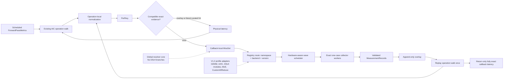

# AIC V1.2: Profile-Complete Online Collection for SGLang DeepSeek-V4

**Status:** Review-ready V1.2 design

**Date:** 2026-07-07

**Implementation baseline:** 911e42757c8748af6cf97ccf577712b1fca5f4cc

**Scope:** Global lazy-resolution architecture with coverage-complete online collection for one frozen SGLang DeepSeek-V4 deployment profile

## Decision summary

AIC V1.2 extends the global V1 lazy-resolution substrate so the actual AIC operation query path can discover every exact physical performance point it consumes. A covered operation normalizes its runtime inputs once, beside its existing query semantics. In explicit resolving mode, those same normalized fields form a PerfKey. The database probes the overlay and literal curated rows for that key. If exact evidence is absent, the actual operation walk records the miss, continues only far enough to expose the remaining physical dependencies, discards the provisional composite result, collects all unique misses in hardware-safe waves, appends validated records, and replays the same operation walk once.

The architecture is global and contains no DeepSeek-V4-specific branches. V1.2 adapter coverage is intentionally narrower: it is complete for one frozen aggregated SGLang DeepSeek-V4 deployment. Other AIC operations participate through the same capability contract but remain structured-unsupported until they add a lazy adapter or an explicit deterministic contract.

V1.2 retains PerfKey, MissSet, MeasurementRequest, MeasurementRecord, ResolutionSession, the append-only overlay, registry-driven collectors, hardware-aware scheduling, and one replay. It removes three proposed duplicate concepts:

- no EvidenceQuery type;
- no separate dataset_id;
- no collector_ref.

PerfKey.namespace is the sole persisted dataset identity. Together with the backend and backend version already carried by PerfKey.environment, it forms the registry route; no second dataset or collector identity is introduced.

## Architecture at a glance



The operation walk, resolver, evidence store, registry protocol, and scheduler are global. Only the set of adapters required to make the frozen deployment profile complete is V1.2-specific.

## Relationship to V1

This document extends docs/plans/2026-07-06-dynamic-lazy-perf-collection-design.md and its implementation plans.

The following V1 decisions remain unchanged:

- pure prediction is the default and performs no collection;
- exact overlay and literal curated rows may satisfy a resolving lookup;
- interpolation, extrapolation, clamping, and empirical estimates cannot satisfy a resolved callback;
- one callback accumulates a complete MissSet before collection;
- successful measurements are append-only and provenance-bearing;
- valid partial records survive a later failure;
- hardware resources are leased through conflict-aware waves;
- a replay occurs at most once;
- independent coordinators may duplicate measurements because distributed single-flight is deferred.

For the V1.2 reference profile, this document supersedes conflicting V1 shape-propagation and miss-discovery details:

- scheduled ForwardPassMetrics aggregates, not a per-request ConcreteBatchDescriptor, are the authoritative runtime workload;
- operations do not separately forecast measurement requests;
- the actual operation query path is traced using the same normalized values used by prediction;
- attention-DP, context parallelism, and MTP are excluded by the frozen profile rather than generalized in this release.

Existing V1 measurement_request hooks may be retained temporarily for migration, but V1.2-covered operations must not maintain a second normalization path. They migrate to one shared normalization helper consumed by ordinary lookup and resolution tracing.

## Frozen reference deployment

| Axis | V1.2 value |
|---|---|
| Serving mode | Aggregated |
| Model | sgl-project/DeepSeek-V4-Flash-FP8 |
| Backend | SGLang 0.5.10 |
| System | gb200 |
| Hardware lease | One four-GPU NVLink-connected node |
| Tensor parallelism | 4 |
| Attention data parallelism | 1 |
| Context parallelism | 1 |
| Pipeline parallelism | 1 |
| MoE tensor parallelism | 1 |
| MoE expert parallelism | 4 |
| MoE backend | Existing non-DeepEP, non-MegaMoE path |
| MTP | Disabled, nextn=0 |
| GEMM quantization | fp8_block, with BF16 for router and logits operations |
| MoE quantization | fp8_block |
| KV-cache quantization | fp8 |
| FMHA/module table dtype | bfloat16 |
| Communication dtype | half |
| Workload distribution | power_law_1.01 |
| Evidence policy | Reuse compatible exact curated rows; measure only absent exact keys |

The profile is a release boundary, not a new runtime schema. A later profile must pass capability preflight independently.

## Goals

1. Resolve every physical measured dependency reached by the frozen profile from exact curated or on-demand evidence.
2. Use scheduled ForwardPassMetrics as the runtime workload without adding per-request vectors or calibration heuristics.
3. Preserve the existing AIC phase and compound-operation semantics.
4. Discover physical dependencies from the actual query path, not a parallel forecast graph.
5. Reuse existing collector registries and benchmark implementations through exact one-case adapters.
6. Deduplicate identical physical keys while retaining every runtime consumer.
7. Saturate independent GPUs without overlapping declared device or fabric contention domains.
8. Return a callback latency only after every measured contribution is exact and compatible.
9. Prove a cold deterministic Mocker replay followed by a zero-collection warm replay.
10. Keep the core mechanism model-agnostic so later operations require adapters, not resolver redesign.

## Non-goals

V1.2 does not:

- add lazy adapters for every operation currently defined in AIC;
- support another model, backend, backend version, or system profile;
- support attention-DP greater than one;
- support context parallelism greater than one;
- support MTP;
- support disaggregated serving;
- support DeepEP or MegaMoE;
- add per-request FPM arrays, histograms, or new calibration features;
- key on FPM variance fields;
- force remeasurement of compatible exact curated rows;
- collect an exhaustive offline grid beyond points encountered by the FPM stream;
- promote overlay records into released curated databases;
- add a new graph IR, Rhino runtime dependency, fusion search, or graph partitioner;
- add distributed single-flight across independent coordinators;
- change the normal pure-prediction contract.

## Global contract versus V1.2 coverage

The global resolver substrate applies to every operation walk. Each operation encountered in explicit resolving mode belongs to exactly one category:

1. **Measured leaf with an adapter:** forms a PerfKey and may collect on an exact miss.
2. **Deterministic operation:** returns an explicitly reviewed analytical result and emits no key.
3. **Composition-only operation:** executes its real children under the trace and emits no key of its own.
4. **Unsupported measured operation:** returns a structured capability failure.

V1.2 guarantees that every operation reachable by the frozen profile is in categories 1 through 3. It does not claim that every other AIC operation has a collector adapter.

Generic resolution modules, public evidence types, the overlay, the scheduler, and the executor must contain no model-name, DSv4 operation-name, or DSv4 perf-filename branches.

## Canonical identity: PerfKey only

PerfKey remains the sole reusable physical identity:

~~~text
PerfKey(
  namespace = "dsv4_csa_generation_module_perf.txt/v1",
  query = {
    tp_size: 4,
    num_heads: ...,
    compress_ratio: 4,
    batch_size: 8,
    sequence_length: 4096,
    kv_cache_dtype: "fp8",
    gemm_type: "fp8_block"
  },
  environment = {
    system: "gb200",
    backend: "sglang",
    backend_version: "0.5.10",
    hardware_compatibility: ...,
    software_compatibility: ...,
    profile_compatibility: ...
  }
)
~~~

### Namespace

PerfKey.namespace is derived mechanically from:

~~~text
canonical PerfFile value + perf-schema revision
~~~

The canonical PerfFile values already used by collector registries are the source of the dataset portion. No dataset_id field or PerfNamespace type is added.

The registry builds a reverse index over namespace and version route. Exactly one lazy entry may match a tuple of namespace, backend, and backend version. Missing or ambiguous matches fail capability preflight.

If one physical schema later has multiple collector implementations, existing backend and version routing selects the implementation. That does not require another persisted identity.

### Query fields

The query mapping contains only normalized fields that define the physical lookup. It excludes:

- operation instance names;
- layer multiplicity and scale factor;
- consumer identity;
- dictionary insertion order;
- physical GPU indices and UUIDs;
- FPM variance;
- provisional interpolated values.

An operation name is diagnostic metadata. Scale and multiplicity remain consumer semantics applied during replay.

### Environment compatibility

Environment fields prevent incompatible reuse. They include the relevant system class, backend and version, runtime/kernel compatibility, protocol compatibility, and topology class for communication.

The frozen model artifact participates in overlay compatibility for module collectors whose persisted table schema cannot distinguish model artifacts. It remains provenance for other datasets. Physical device IDs are provenance, not reuse identity.

## Single-source operation normalization

Every V1.2 measured physical lookup has one normalization helper colocated with the operation or physical-operation module that owns the query semantics.

Conceptually:

~~~python
normalized = operation.normalize_perf_query(runtime_inputs)
ordinary_result = database.query_using(normalized)

if resolution_trace_is_active:
    key = build_perf_key(operation.perf_namespace, normalized, environment)
    probe_exact_evidence(key)
~~~

The ordinary query and PerfKey construction consume the same normalized values. The adapter receives the final canonical fields and may only translate their names or ordering into collector arguments. It may not reinterpret raw runtime inputs, redo TP/head aliases, rescale tokens, or select another dataset.

Pure mode may avoid serialization and hashing, but it must call the same normalization helper.

When a compound operation directly delegates to a physical database lookup, the canonical normalization helper remains beside the physical operation definition and is reused by that delegated path. For example, MoEDispatch selects a CustomAllReduce branch, while the communication module owns the CustomAllReduce key schema.

## Exact lookup and actual-query tracing

An explicit ResolutionSession activates a callback-local trace.

For each covered physical lookup:

1. Construct the normalized query through the actual operation path.
2. Build the PerfKey in resolving mode.
3. Probe a compatible overlay record.
4. Probe a literal compatible curated row.
5. If either exact source hits, return the raw physical result and apply normal operation scaling.
6. Otherwise, record the PerfKey and current consumer in MissSet.
7. Continue the operation walk with the existing approximate result only as a discovery surrogate.
8. Mark the callback result tainted and ineligible for return.

After the operation walk:

- if MissSet is empty, return the complete latency normally;
- if MissSet is non-empty, discard every provisional aggregate, resolve all unique misses, append valid records, and replay the same walk once;
- if the replay encounters any unresolved measured key or approximate source, fail structurally.

A provisional value never advances Mocker time, affects a later scheduler decision, becomes an overlay record, or satisfies a candidate score.

An operation whose later physical dependency selection depends on a provisional latency value cannot use generic tracing safely. It must expose an explicit deterministic child traversal or remain unsupported. V1.2 contract tests prove that covered branch selection depends only on configuration and shape.

## Compound-operation semantics

A compound operation declares one of two mutually exclusive contracts.

### Composition-only compound

A composition-only compound has no measured namespace of its own. It executes its actual children under the trace and then applies its existing composition.

Examples:

- OverlapOp sums each group and returns the maximum group latency.
- The frozen profile's generic MoEDispatch executes the communication branch chosen by backend, topology, and parallel configuration.

Repeated child keys deduplicate in MissSet while retaining all consumers. A single CustomAllReduce point used by both pre-dispatch and post-dispatch is measured once and contributes at both replay positions.

For example, consider a frozen-profile decode step with eight tokens. The existing `OverlapOp` executes two groups:

```text
group A, routed experts:
  BF16 router GEMM
  pre-dispatch CustomAllReduce(half, world_size=4, elements=32768)
  fp8_block MoE
  post-dispatch CustomAllReduce(half, world_size=4, elements=32768)

group B, shared expert:
  fp8_block gate/up GEMM
  deterministic elementwise activation
  fp8_block down GEMM
```

Both collective consumers normalize to the same PerfKey, so the cold trace records one missing physical measurement with two consumers. After collection, replay applies that one exact record at both positions and preserves the existing composition:

```text
latency = max(sum(group A), sum(group B))
```

Neither `OverlapOp` nor `MoEDispatch` receives a synthetic aggregate key. The actual selected children remain the measured boundaries.

### Measured compound boundary

A compound with a dedicated full-module table emits one physical key for that module boundary and does not also recurse into implementation sub-kernels.

The frozen profile's CSA/HCA context and generation attention modules use this contract. Their module records already represent the measured boundary. Recursing into internal kernels would double count.

Capability preflight rejects a compound that attempts to use both contracts for one contribution.

## ForwardPassMetrics workload contract

Scheduled ForwardPassMetrics are authoritative. V1.2 consumes the existing fields:

- num_prefill_requests;
- sum_prefill_tokens;
- sum_prefill_kv_tokens;
- num_decode_requests;
- sum_decode_kv_tokens.

The queued metrics, wall time, var_prefill_length, and var_decode_kv_tokens are not estimator inputs and do not participate in PerfKey.

No new FPM schema is required. With MTP disabled, one decode request contributes one scheduled decode token, so num_decode_requests is the decode token count used by the existing operation walk.

V1.2 preserves the existing rank-latency dispatch and integer projection rules:

- prefill only uses the existing context operation walk;
- decode only uses the existing generation operation walk;
- mixed prefill and decode uses the existing three-pass composition;
- new prefill tokens per request, prefix per request, and decode KV per request use the current engine's integer rules;
- the combined non-attention pass, context-attention pass, and generation-attention pass receive the same fields they receive today.

No snapping, nearest-shape calibration, new distribution heuristic, or variance correction is added. Exact means exact relative to this deterministic AIC abstraction.

Because the frozen profile has attention-DP one, forward-pass latency contains one rank's FPM projection. Multi-rank partitioning is deferred.

## Frozen-profile operation coverage

| Operation family | Evidence boundary | Namespace | Required modes | Expected resources |
|---|---|---|---|---|
| Embedding | Deterministic memory model | none | Existing | none |
| ElementWise | Deterministic memory model | none | Existing | none |
| DeepSeekV4MHCModule | Full mHC pre/post module | mhc_module_perf.txt/v1 | BF16 | one GPU |
| Context DSv4 CSA | Full attention module | dsv4_csa_context_module_perf.txt/v1 | TP4, FP8 KV, FP8-block GEMM | one GPU exact runner with current TP simulation |
| Context DSv4 HCA/SWA approximation | Full attention module | dsv4_hca_context_module_perf.txt/v1 | TP4, FP8 KV, FP8-block GEMM | one GPU exact runner with current TP simulation |
| Generation DSv4 CSA | Full attention module | dsv4_csa_generation_module_perf.txt/v1 | TP4, FP8 KV, FP8-block GEMM | one GPU exact runner with current TP simulation |
| Generation DSv4 HCA/SWA approximation | Full attention module | dsv4_hca_generation_module_perf.txt/v1 | TP4, FP8 KV, FP8-block GEMM | one GPU exact runner with current TP simulation |
| GEMM | Physical GEMM | gemm_perf.txt/v1 | BF16 and fp8_block shapes reached by profile | one GPU |
| MoE | Physical MoE compute | moe_perf.txt/v1 | fp8_block, power_law_1.01, TP1, EP4 | one GPU synthetic local-rank runner |
| MoEDispatch | Composition-only | none | Existing SGLang non-DeepEP branch | child contract |
| CustomAllReduce | Physical four-rank collective | custom_allreduce_perf.txt/v1 | half, world size 4, exact element count | four NVLink-connected GPUs; reserve fabric domain |
| OverlapOp | Composition-only max of group sums | none | Existing | child contracts |
| P2P | Deterministic no-op at PP1 | none | Existing | none |

The shared and router/logits GEMMs use the GEMM adapter. The context and generation MoE branches use the same MoE schema with phase-independent physical keys where the existing schema does so.

The frozen CP1 profile does not reach DSv4 sparse-kernel corrections, top-k calibration, or CP all-gathers. Those namespaces are not V1.2 coverage requirements.

The frozen generic dispatch path selects CustomAllReduce for TP4/DP1/CP1. NCCL remains a generic non-DSv4 pilot and regression gate but is not required by this profile's operation walk.

## Collector registry and exact one-case adapters

The existing canonical OpEntry and LazyOpEntry registry types remain authoritative.

Registry resolution uses:

~~~text
PerfKey.namespace + backend + backend version
~~~

Each V1.2 lazy entry provides:

- an installable exact one-case runner;
- a canonical-key-to-case translator;
- a resource-contract function;
- a result-to-record validator;
- protocol, timer, and tuning revisions.

The resolver never infers a collector from raw operation kwargs. The adapter never changes the PerfKey.

Offline sweep collectors may delegate to the same exact runner, but a lazy request must not invoke a grid sweep, append directly to a curated perf file, or call an offline logging path. The ResolutionSession coordinator remains the only overlay writer.

Heavy framework imports occur only in worker processes. Lightweight registry and adapter imports must not import Torch, SGLang, or CUDA.

Adapters may group compatible requests in one persistent worker to amortize model or communicator setup. Every physical point is still warmed, timed, sampled, validated, and recorded independently. Grouping is orchestration, not a fused latency measurement.

## Hardware-aware collection

Each MeasurementRequest receives a ResourceContract before scheduling.

For the frozen four-GPU lease:

- independent one-GPU requests may occupy disjoint GPUs in the same wave;
- requests that share a persistent model/runtime may be grouped on one worker;
- the four-GPU CustomAllReduce request reserves all four compatible GPUs and their NVLink fabric domain;
- no single-GPU benchmark co-runs with the four-GPU collective wave;
- workers use assigned device UUIDs and local visible ordinals;
- measurements from parallel jobs remain independent records.

Resource discovery and placement are generic. No DSv4 condition appears in the scheduler.

## Cold callback data flow

~~~text
Mocker emits one scheduled FPM
  -> AIC selects prefill, decode, or mixed operation composition
  -> ResolutionSession enables actual-query tracing
  -> each measured physical lookup probes a PerfKey
  -> exact hits return normally
  -> exact misses accumulate in one MissSet
  -> composition completes provisionally
  -> provisional callback result is discarded
  -> registry resolves every unique missing namespace
  -> capability and resource checks run before GPU acquisition
  -> scheduler packs hardware-safe waves
  -> workers run exact cases
  -> coordinator validates and appends successful records
  -> AIC replays the same operation walk once
  -> every measured lookup must be exact
  -> final latency returns to Mocker
~~~

Later callbacks and candidates reuse compatible overlay records. An identical warm replay performs no collection.

## Failure semantics

Resolution fails closed. Structured failures include:

- unsupported namespace;
- ambiguous registry route;
- unsupported exact shape;
- unavailable resource topology;
- budget exceeded;
- collector launch failure;
- collector timeout;
- invalid samples or non-finite latency;
- protocol or provenance mismatch;
- emitted row does not round-trip to the requested PerfKey;
- dependency selection requires a provisional numeric value;
- unresolved key after the single replay.

A failed physical request does not become zero latency, an empirical result, or an interpolated resolved result.

Valid records from other requests in the same wave remain committed. The current callback remains unresolved until all of its keys are exact.

Cancellation stops queued work and safely aborts or completes active workers according to collector capability. Overlay transactions remain short and parent-owned.

## Capability preflight

Before the reference replay, preflight builds the frozen model and classifies every reachable operation as measured, deterministic, composition-only, or unsupported.

For every measured namespace, preflight verifies:

- one unambiguous registry route for SGLang 0.5.10;
- required exact quantization and shape capability;
- installable lightweight adapter imports;
- resource-contract construction;
- available GB200 GPU/fabric topology;
- matching schema, protocol, timer, and tuning revisions.

Runtime tracing remains authoritative for the exact shape-local dependency set. Preflight is a completeness gate, not a replacement for the actual trace.

## Observability

Each callback resolution report records:

- FPM identity, rank, and counter;
- selected prefill/decode/mixed path;
- unique PerfKeys and consumer counts;
- overlay hits, curated exact hits, and misses;
- namespaces and registry routes;
- hardware assignments and wave structure;
- worker and invocation identities;
- sample count, selected statistic, units, and protocol;
- framework, kernel, GPU, topology, and model provenance;
- partial successes and structured failures;
- replay outcome and final exact evidence sources.

The candidate report links to the overlay records used for its final score.

## Validation strategy

### Generic unit gates

Generic resolution tests use fake operations and contain no DSv4 imports. They prove:

- namespace and query canonicalization;
- one normalization result feeds ordinary lookup and PerfKey;
- exact overlay and literal curated precedence;
- a missing exact row is traced even when ordinary lookup can interpolate;
- provisional results cannot escape a tainted callback;
- MissSet deduplicates keys and retains consumers;
- composition-only compounds trace actual children;
- measured compounds do not recurse;
- identical child keys contribute at every replay position;
- registry ambiguity and missing routes fail preflight;
- result rows round-trip to identical keys;
- one replay is enforced.

### Non-DSv4 generic integration gates

Before the DSv4 end-to-end gate:

- BF16 GEMM proves direct single-GPU exact collection;
- NCCL proves generic multi-GPU topology-aware collection;
- a mixed fake workload proves single-GPU wave packing and collective isolation;
- pure prediction remains behaviorally unchanged and GPU-free.

### Frozen-profile operation contract tests

Every measured namespace proves:

~~~text
runtime inputs
  -> one normalized physical query
  -> PerfKey
  -> exact curated probe or miss
  -> collector case
  -> emitted row
  -> identical PerfKey
~~~

Tests cover:

- BF16 and fp8_block GEMM normalization;
- mHC pre and post keys;
- CSA/HCA context and generation module keys;
- FP8-block MoE TP1/EP4 and power-law distribution;
- CustomAllReduce half/world4/element-count normalization;
- scale factor excluded from physical identity;
- model artifact compatibility where the persisted schema omits it;
- adapter rejection of any shape outside the frozen capability envelope.

### GB200 GPU gates

On a four-GPU GB200 node:

- each exact one-case runner produces positive finite samples and a round-tripping record;
- repeated one-GPU keys perform no second command;
- independent one-GPU cases may run concurrently without assigned-device overlap;
- CustomAllReduce uses one persistent four-rank group and reserves the NVLink domain;
- single-GPU work does not overlap the collective wave;
- repeated collective keys perform no second collective command;
- measurements are compared with isolated controls using a documented robust interval.

### Mocker end-to-end gate

A deterministic aggregated replay contains:

1. a prefill-only step;
2. a mixed prefill/decode step;
3. a decode-only step;
4. at least one repeated shape.

Starting with an empty overlay and the normal curated database:

- every compatible literal curated point is reused;
- every missing reachable physical point is measured exactly once per unique PerfKey;
- no reachable operation is unsupported;
- no provisional or interpolated value appears in the returned callback latency;
- the complete cold replay succeeds;
- closing and reopening the overlay preserves reuse;
- the identical warm replay issues zero GPU measurement commands;
- cold and warm final latencies and evidence identities match.

## Implementation decomposition

This umbrella design is implemented through four ordered plans:

1. **Actual-query trace and key convergence**
   - add shared normalization seams;
   - make PerfKey.namespace the sole dataset identity;
   - add exact probe/taint tracing;
   - add registry reverse lookup;
   - migrate existing forecast hooks without changing pure prediction.

2. **Single-GPU frozen-profile adapters**
   - BF16 and fp8_block GEMM;
   - mHC;
   - four DSv4 attention-module namespaces;
   - FP8-block MoE;
   - exact one-case APIs and persistent worker grouping.

3. **Four-GPU CustomAllReduce adapter**
   - exact SGLang one-case runner;
   - persistent four-rank runtime;
   - NVLink resource contract;
   - isolated-control validation.

4. **FPM and Mocker end to end**
   - explicit resolving path from scheduled FPM;
   - capability preflight and reporting;
   - deterministic cold/warm replay;
   - packaging and restart reuse.

Each plan must pass its own generic tests before the next plan begins.

## Success criteria

V1.2 is complete when:

1. Core resolution code contains no DSv4-specific branch.
2. PerfKey is the only physical identity type and namespace is the only dataset discriminator.
3. Every measured operation reachable by the frozen profile has one exact adapter route.
4. Every deterministic or composition-only operation reachable by the profile has an explicit reviewed contract.
5. Actual-query tracing discovers every physical dependency without a parallel forecast graph.
6. No provisional value escapes a callback containing misses.
7. A unique physical key is measured at most once per coordinator and compatible overlay lifetime.
8. Consumer multiplicity and compound composition are preserved on replay.
9. Hardware waves saturate disjoint one-GPU capacity and isolate the four-GPU collective.
10. The deterministic cold replay succeeds and the identical warm replay performs zero GPU work.
11. Pure prediction remains API-compatible, behaviorally compatible, and collection-free.
12. Other AIC operations can add support through normalization plus registry metadata without changing the resolver.

## Explicitly deferred extensions

Later releases may add, independently:

- additional AIC operation namespaces;
- another DSv4 deployment profile;
- attention-DP rank-specific FPM;
- CP sparse corrections and communication leaves;
- MTP scheduled-token semantics;
- DeepEP and MegaMoE;
- disaggregated serving;
- per-request workload descriptors;
- distributed collection coordination;
- curated-data promotion.

None is an implicit requirement of V1.2.
