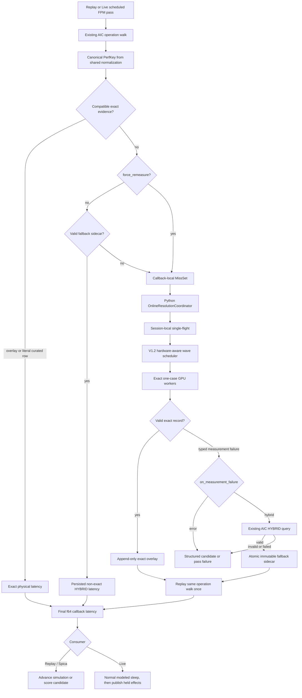

# AIC V1.3: Unified Online Resolution for Replay, Spica, and Live Mocker

**Status:** Approved V1.3 design

**Date:** 2026-07-08

**AIC repository head at design time:** 2fc06db4f9a7c8ab15e578024b9b7b4a1e19b7e8

**Dynamo repository head at design time:** 1fe16eb6b2e5318d78f5ece7733e054bab7ef938

**Scope:** Extend the V1.2 exact-shape resolver into a single blocking online-resolution contract shared by Replay, Spica, and the supported Live Mocker path, with durable AIC HYBRID degradation when explicitly requested.

## Decision summary

AIC V1.3 removes the architectural distinction between an offline collection phase and a later prediction phase for the supported serving profile. The normal AIC operation walk remains the source of truth. When that walk encounters a physical performance key without compatible exact evidence, it exposes the complete callback-local `MissSet`, measures those real shapes with the V1.2 hardware-aware executor, persists valid exact records, and replays the same walk. The same mechanism is available to Replay, Spica, and Live Mocker.

All current `measure_on_miss` behavior is blocking. A callback either obtains the evidence needed for the current pass or applies its configured failure policy before returning. V1.3 does not use a misleading second “blocking” policy name. A future policy that intentionally returns before measurement completes would be named separately, for example `measure_for_next_hit`.

One public `aic_resolution` schema owns the resolution policy everywhere. The existing Spica-only `lazy_collection` name is removed without an alias or compatibility period. It is a hard configuration error with a direct message to use `aic_resolution`.

The default failure behavior remains exact and fail-closed. With `on_measurement_failure: error`, Replay and Spica mark the candidate unscorable, while Live rejects the affected pass without publishing its effects. With `on_measurement_failure: hybrid`, unresolved physical keys fall through to AIC's existing HYBRID lookup, are persisted as explicitly non-exact sidecar records, and allow the operation walk to be recomputed. No emergency constant, operator-supplied latency, or new prediction formula is introduced. If ordinary AIC HYBRID cannot produce a valid result, resolution fails structurally.

Live calibration occurs before normal simulated execution. The scheduler withholds all pass effects, blocks for exact measurement or HYBRID resolution, recomputes the pass latency, performs the normal modeled sleep, and only then publishes the held effects. Clients therefore observe calibration wall time plus modeled serving delay. Calibration wall time does not advance Mocker virtual time.

## Architecture at a glance



The operation graph, physical identities, measurement requests, registry routes, exact collectors, scheduler, workers, and exact overlay remain the V1.2 mechanisms. V1.3 adds a shared public policy, a coordinator capable of bounded blocking and safe late completion, a non-exact fallback sidecar, and a transactional Live boundary.

## Relationship to V1.2

This document extends `docs/superpowers/specs/2026-07-07-aic-dsv4-online-collection-v1-2-design.md`.

The following V1.2 decisions remain unchanged:

- scheduled `ForwardPassMetrics` aggregates are the runtime workload;
- the actual AIC operation walk discovers physical dependencies;
- ordinary lookup and resolution use one operation-local normalization path;
- `PerfKey` is the sole physical identity;
- `MeasurementRequest`, `MissSet`, `MeasurementRecord`, and `ResolutionSession` remain the core evidence types;
- one callback accumulates a complete deduplicated `MissSet` before collection;
- consumer multiplicity is retained even when physical keys deduplicate;
- exact records are append-only, protocol-bound, and provenance-bearing;
- valid partial exact records survive another request's failure;
- the hardware-aware scheduler packs disjoint single-GPU work and isolates conflicting multi-GPU fabric work;
- the same operation walk replays at most once;
- no operation-specific branch is added to generic resolution infrastructure;
- no new graph IR, dependency forecast path, Rhino runtime dependency, or offline grid sweep is added;
- pure prediction remains collection-free when `aic_resolution` is absent.

V1.3 supersedes these V1.2 boundaries:

- measure-on-miss is no longer Replay-only;
- Live Mocker is no longer required to remain resolution-free;
- a callback configured for HYBRID failure handling may return a deliberately degraded, fully recomputed latency rather than requiring every contribution to be exact;
- the public Spica name `lazy_collection` is removed in favor of the same `aic_resolution` contract used by direct Mocker;
- a per-callback blocking limit is distinct from the cumulative session collection budget;
- an exact measurement may safely finish after a HYBRID response and supersede that fallback on a future lookup.

The V1.2 exact contract is preserved when `on_measurement_failure` is `error`. A degraded result is never represented as an exact `MeasurementRecord`, never enters the exact overlay, and never silently satisfies an exact-only callback.

## Goals

1. Let a supported Live Mocker pass discover and measure unseen real shapes using the same AIC operation path as prediction.
2. Share one public online-resolution policy across Replay, Spica, and Live Mocker.
3. Preserve V1.2 exact identity, exact overlay, one-replay, and hardware-safety guarantees.
4. Resolve the entire deduplicated `MissSet` from one pass in hardware-aware waves rather than launching one benchmark at a time.
5. Saturate independent configured GPUs while reserving every GPU and fabric domain required by communication measurements.
6. Bound the wall time for which one Live pass may wait independently of the cumulative session collection budget.
7. Allow safe exact work to complete after a per-pass timeout and take precedence on later lookups.
8. Provide an explicit, durable, provenance-bearing AIC HYBRID fallback when exact measurement fails.
9. Prevent calibration, failed resolution, or provisional values from advancing virtual time or leaking pass effects.
10. Prove cold measurement, persistence, warm reuse, process reopen reuse, and zero repeated GPU work for every supported attention route.
11. Keep the callback ABI as `Result<f64, AicCallbackError>` for V1.3.
12. Keep pure prediction unchanged when `aic_resolution` is absent.

## Non-goals

V1.3 does not:

- add an asynchronous `measure_for_next_hit` policy;
- add distributed or cross-process single-flight;
- prevent independent processes from performing the same cold measurement concurrently;
- support disaggregated serving;
- support vLLM Live resolution;
- support attention data parallelism greater than one;
- support context parallelism greater than one or MTP;
- expand the frozen V1.2 model/backend/system profile;
- add per-request workload arrays or a second operation-dependency graph;
- add typed exact/degraded values to the Rust callback ABI;
- add native pass-level degradation annotations or Mocker metrics;
- promote sidecar records into the exact overlay or released curated data;
- add fallback TTL, automatic retry, or background refresh;
- invent an emergency latency when AIC HYBRID fails;
- retain or alias the `lazy_collection` configuration name;
- support mixed V1.2/V1.3 configuration schemas or mixed-version deployment.

## Supported Live profile

V1.3 Live support is deliberately limited to the V1.2 frozen profile:

| Axis | V1.3 Live value |
|---|---|
| Engine | SGLang |
| Serving mode | Aggregated |
| Model | `sgl-project/DeepSeek-V4-Flash-FP8` |
| Backend version | SGLang 0.5.10 |
| System | GB200 |
| Tensor parallelism | 4 |
| Attention data parallelism | 1 |
| Context parallelism | 1 |
| Pipeline parallelism | 1 |
| MoE tensor parallelism | 1 |
| MoE expert parallelism | 4 |
| MTP | Disabled |
| Exact operation coverage | V1.2 GEMM, mHC, CSA/HCA attention modules, MoE, and CustomAllReduce |

Unsupported engine, serving-mode, model, version, or topology combinations fail validation before constructing a resolution session or acquiring GPUs. HYBRID is a measurement-failure policy, not a way to bypass the supported-profile gate.

## One public configuration contract

### Canonical `AicResolutionConfig`

The public configuration is named `aic_resolution` in direct Mocker, Replay, and Spica:

```yaml
aic_resolution:
  policy: measure_on_miss
  on_measurement_failure: hybrid
  overlay_path: /absolute/path/perf.sqlite
  fallback_cache_dir: /absolute/path/perf.sqlite.live-fallbacks
  max_new_keys: 256
  max_wall_seconds: 600.0
  max_block_seconds: 30.0
  force_remeasure: false
```

The fields have these meanings:

| Field | Contract |
|---|---|
| `policy` | `observe_only` or blocking `measure_on_miss`; absence of the whole block is pure prediction |
| `on_measurement_failure` | `error` or `hybrid`; defaults to `error` |
| `overlay_path` | Absolute path to the append-only exact SQLite overlay; lexically normalized by collapsing repeated separators (including leading `//` to `/`), `.`, and `..` without consulting filesystem existence or symlinks |
| `fallback_cache_dir` | Optional absolute path to immutable non-exact fallback files, lexically normalized by the same rule; defaults to `<normalized overlay_path>.live-fallbacks/` |
| `max_new_keys` | Cumulative unique physical-key budget for the resolution session |
| `max_wall_seconds` | Cumulative physical collection wall-time budget for the resolution session |
| `max_block_seconds` | Positive per-callback wait bound; required for Live `measure_on_miss` |
| `force_remeasure` | Bypass fallback-sidecar hits for this run, but never bypass compatible exact evidence |

`max_wall_seconds` and `max_block_seconds` are intentionally different. The former caps cumulative collection work across the session. The latter caps how long one caller waits for its current pass. They must not be merged or interpreted as aliases.

`on_measurement_failure` is also distinct from an AIC database mode. It controls what the online-resolution owner does after exact physical measurement fails. The `hybrid` branch then invokes ordinary AIC HYBRID behavior for the same normalized operation query.

`observe_only` never launches measurement and therefore cannot use HYBRID as a measurement-failure recovery path. Supplying `on_measurement_failure: hybrid` with `policy: observe_only` is a validation error.

### Aggressive schema cutover

V1.3 performs a coordinated schema replacement:

- `LazyCollectionConfig` is replaced by `AicResolutionConfig`;
- `SmartSearchConfig.lazy_collection` is replaced by `SmartSearchConfig.aic_resolution`;
- `lazy_collection` is not accepted as an alias;
- a configuration containing `lazy_collection` fails with a targeted message directing the author to `aic_resolution`;
- repository examples, tests, generated payloads, and documentation change in the same cutover;
- AIC and Dynamo deployments pin a matched V1.3 pair; no mixed-version compatibility shim is provided.

### Policy versus resource orchestration

Resolution policy and GPU-pool orchestration are separate concepts:

| Type | Owner | Purpose |
|---|---|---|
| `AicResolutionConfig` | Shared public contract | Evidence policy, paths, budgets, deadline, and force behavior |
| `MeasurementResourcePool` | Spica orchestration | Set of disjoint GPU groups available to parallel evaluators |
| `MeasurementLease` | Runtime internal | One concrete GPU group bound to one resolution owner |

Spica authors configure the pool outside `aic_resolution`:

```yaml
measurement_gpu_groups:
  - [0, 1, 2, 3]
  - [4, 5, 6, 7]
```

Spica assigns one group to an evaluator and materializes that group as a concrete runtime `gpu_ids` lease. Pools are never passed into AIC's resolver. Direct Mocker and Replay launchers likewise bind one concrete lease, not a pool. The internal serialized Dynamo payload may carry the leased `gpu_ids`, but that binding is not part of the reusable policy identity and never enters `PerfKey`.

Within a lease, the existing hardware inventory and scheduler decide how each `MeasurementRequest` is placed. A four-GPU lease can run disjoint one-GPU measurements concurrently, while a four-rank CustomAllReduce reserves all four devices and their fabric domain in its own wave.

## Evidence model

### Exact evidence remains unchanged

Compatible exact evidence comes only from:

1. a valid protocol-compatible record in the append-only overlay; or
2. a literal compatible curated row.

Interpolation, extrapolation, clamping, empirical estimates, HYBRID results, and fallback sidecars are not exact evidence. Exact lookup always occurs before fallback lookup. A compatible exact record therefore supersedes an older fallback without deleting or mutating it.

`MeasurementRequest` remains the executable work order for one physical `PerfKey`. `MissSet` remains the callback-local deduplicated collection of those work orders plus every consumer. `MeasurementRecord` remains the protocol-bound result of real physical measurement. V1.3 does not add replacements for any of these types.

### Per-key fallback sidecar

A HYBRID result is persisted outside the exact overlay as one immutable JSON file per fallback identity. It represents one missing physical operation key, never an aggregate pass latency. After exact and fallback outcomes are established for every physical dependency, AIC recomputes the complete FPM through the normal operation composition.

The fallback identity is a digest of canonical JSON containing:

- fallback schema revision;
- the complete canonical `PerfKey`, including its environment compatibility;
- the AIC prediction revision that owns the HYBRID semantics.

It excludes timestamps, physical device IDs, worker IDs, the transient measurement failure text, pass identity, and consumer identity. A change in physical identity, environment compatibility, prediction behavior, or fallback schema produces a new file naturally. V1.3 has no TTL.

Conceptually, a record is:

```json
{
  "schema_version": 1,
  "identity_digest": "sha256:...",
  "key_digest": "...",
  "canonical_perf_key": {
    "namespace": "...",
    "query": {},
    "environment": {}
  },
  "latency_ms": 1.234,
  "timing_source": "hybrid",
  "hybrid_provenance": {
    "source": "empirical",
    "prediction_revision": "..."
  },
  "exact": false,
  "measurement_failure": {
    "code": "timeout",
    "operation": "attention.context",
    "detail": "collector deadline expired"
  },
  "created_at": "RFC3339 timestamp"
}
```

The writer:

1. validates finite positive latency and complete identity/provenance;
2. writes a uniquely named temporary file in the destination directory;
3. flushes the file;
4. publishes it with atomic no-replace semantics;
5. validates and accepts an existing winner if another process won the race.

The first valid writer wins. Cross-process duplicate benchmarking is acceptable, but readers never observe a partial record and later writers never overwrite the winner.

A malformed or identity-mismatched sidecar is never consumed. The resolver emits a structured error and treats the key as missing. Exact measurement may still repair the lookup by writing the exact overlay. If exact measurement also fails and a durable valid fallback cannot be published because the path is corrupt or unwritable, the callback fails rather than returning an undurable value while claiming persistent degradation.

### Lookup precedence

Every physical query uses this order:

1. compatible exact overlay record;
2. compatible literal curated row;
3. valid fallback sidecar, unless `force_remeasure` is active;
4. callback-local exact miss and blocking measurement;
5. configured measurement-failure action.

`force_remeasure` skips step 3 for the current run. It never skips steps 1 or 2. If the forced exact attempt fails under HYBRID policy, AIC recomputes HYBRID; atomic first-writer rules still determine the durable sidecar winner. There is no automatic retry loop.

## Measurement-failure decision tree

For each unresolved physical key:

```text
compatible exact evidence
  -> use exact result

otherwise, valid sidecar and not force_remeasure
  -> use persisted degraded result

otherwise
  -> block on exact measurement
       -> valid record: persist exact and use it
       -> typed eligible failure:
            on_measurement_failure=error
              -> structured callback failure
            on_measurement_failure=hybrid
              -> ordinary AIC HYBRID query
                   -> valid: persist sidecar and use it
                   -> failed: structured callback failure
       -> invariant/configuration/corruption failure
            -> structured callback failure
```

The following `UnresolvedCode` classes are eligible for HYBRID after the physical identity itself has been validated:

- `MISSING_ADAPTER`;
- `UNSUPPORTED_SHAPE`;
- `RESOURCE_UNAVAILABLE`;
- `COLLECTOR_FAILED`;
- `TIMEOUT`;
- `INVALID_MEASUREMENT`;
- `BUDGET_EXHAUSTED`;
- `RETRY_EXHAUSTED`;
- `REQUERY_STILL_MISSING`.

The following do not activate HYBRID:

- `IDENTITY_MISMATCH`;
- `TOPOLOGY_MISMATCH`;
- explicit cancellation or shutdown;
- `OBSERVE_ONLY` termination;
- malformed `PerfKey`, protocol, exact overlay, or sidecar identity;
- ambiguous registry routes;
- unexpected exceptions, programming errors, and violated invariants;
- unsupported engine, model, backend version, or deployment topology rejected by startup preflight.

HYBRID is expected to produce a result for every valid query in the supported profile. Nevertheless, V1.3 preserves a final structured failure if it returns a non-finite/non-positive value, lacks provenance, or raises. There is no second fallback below HYBRID.

### Consumer behavior matrix

| Consumer | `on_measurement_failure: error` | `on_measurement_failure: hybrid` |
|---|---|---|
| Replay | Candidate is unscorable; no provisional virtual-time advance | Candidate is scored using the recomputed degraded latency; report and sidecar expose degradation |
| Spica | Candidate is unscorable and search continues with other candidates | Candidate remains scorable; cache identity includes resolution policy and report exposes degradation |
| Live Mocker | Affected pass is rejected without publishing pass effects or advancing virtual time | Pass continues with recomputed degraded latency, normal modeled sleep, and explicit WARN provenance |

The default is `error` for every consumer.

## Blocking coordinator and single-flight

Python owns online resolution because the operation walk, `ResolutionSession`, exact overlay, collector registry, and hardware executor are already Python-owned. Rust continues to call a synchronous `Result<f64, AicCallbackError>` boundary without holding the GIL while waiting.

An `OnlineResolutionCoordinator` surrounds the existing session responsibilities:

- collect one callback's complete deduplicated `MissSet`;
- recheck exact evidence after discovery;
- consult the fallback store in the defined precedence order;
- group unresolved work into one hardware-aware executor submission;
- own a session-local map of active measurement futures;
- share an active future among requests with the same `PerfKey` and protocol identity;
- persist valid partial exact results immediately;
- enforce cumulative and per-callback budgets;
- derive HYBRID results only for still-unresolved keys;
- replay the operation walk once after all keys have an exact or permitted degraded outcome;
- emit one cumulative resolution report.

Single-flight is session-local. Its identity is the exact physical key plus measurement protocol. It prevents concurrent callbacks owned by one coordinator from duplicating work. Independent coordinators and processes may race, execute duplicate physical measurements, and converge through append-only exact records and first-writer fallback publication. Distributed locks are deferred.

### Complete-MissSet scheduling

The coordinator never launches a benchmark directly from the first missing leaf. It lets the actual operation composition finish its discovery walk, discards the provisional aggregate, and submits the entire unique `MissSet`. The V1.2 scheduler then packs that set into the fewest conflict-free waves it can construct from the leased inventory.

This preserves batching:

- independent one-GPU GEMM, attention, mHC, and MoE work may run on disjoint GPUs in one wave;
- persistent workers may group compatible cases to amortize setup;
- each physical point still receives independent warmup, timing, validation, and record identity;
- a multi-GPU communication request receives the complete compatible group it needs;
- fabric-exclusive collective waves do not overlap conflicting single-GPU work.

The inability to predict future Mocker shapes does not defeat batching. A cold pass batches every unique key discovered in that pass. Later passes hit exact or fallback persistence, and repeated shapes issue no GPU work.

## Deadlines, budgets, and late exact completion

`max_new_keys` and `max_wall_seconds` remain cumulative session budgets. `max_wall_seconds` counts physical collection time, matching V1.2 `ResolutionSession` accounting; it is not reset for each callback.

For one blocking callback:

```text
effective caller deadline = min(
  callback start + max_block_seconds,
  callback start + remaining max_wall_seconds
)
```

Outcomes at the deadline are policy-dependent:

- with `error`, unresolved keys produce a structured callback failure;
- with `hybrid`, unresolved keys query AIC HYBRID, persist sidecars, and let the caller continue;
- exact records completed before the deadline remain committed even if another key times out.

If `max_block_seconds` fires before the remaining cumulative collection deadline, a safely isolated exact measurement future may continue in the background. Its eventual valid record is appended to the exact overlay. The current callback does not change after returning, but the next lookup sees the exact record before the sidecar and therefore performs zero measurement and uses exact latency.

If the cumulative `max_wall_seconds` deadline fires first, the executor cancels or bounds the active work using the V1.2 lifecycle contract. It must not continue consuming unbudgeted GPU time. Late completion is therefore permitted only inside the remaining session collection budget and the coordinator's shutdown contract.

## Replay and Spica data flow

Replay and Spica retain their existing virtual-time behavior:

```text
scheduled aggregate FPM
  -> AIC callback discovery walk
  -> exact and fallback lookup
  -> complete MissSet
  -> blocking coordinator
  -> hardware-aware exact measurement
  -> exact records plus optional per-key HYBRID sidecars
  -> one full operation-walk replay
  -> final f64 latency
  -> advance Replay virtual time exactly once
```

No provisional discovery value advances virtual time or becomes a candidate score. With `error`, a structured callback failure maps to the existing unscorable-candidate path. With `hybrid`, the candidate remains scorable, but its resolution report identifies every degraded key and source.

Spica's candidate cache identity includes the canonical `aic_resolution` policy and assigned resource semantics needed to prevent a pure, exact-only, and HYBRID-degraded evaluation from aliasing. Physical GPU IDs remain execution provenance rather than `PerfKey` identity.

## Live Mocker data flow and effect safety

### Calibration before simulation

For the supported SGLang aggregated scheduler, one pass follows this order:

1. Build the scheduled aggregate and execute the existing internal pass computation with every external effect captured.
2. Invoke the aggregate AIC resolving callback.
3. On a cold miss, block while the coordinator resolves the complete `MissSet`.
4. Recompute the FPM latency from exact and, when allowed, degraded per-key values.
5. Sleep for the final modeled GPU duration while continuing to hold all pass effects.
6. Publish admissions, router/KV effects, outputs, lifecycle events, and metrics once, in their established relative order.

Calibration wall time occurs before step 5. It is visible to clients as real delay but is not added to Mocker's virtual clock or the modeled GPU duration. The client-visible delay for a cold pass is therefore calibration wall time plus modeled sleep. A warm or reopened exact/sidecar hit has no calibration GPU work and pays only ordinary lookup overhead plus modeled sleep. Holding pass-start effects through modeled sleep is deliberate for this transactional path: no externally visible state may depend on a pass until its final timing and simulated execution both succeed.

### Commit frontier

The earliest unresolved Live pass establishes the effect commit frontier. No later pass may publish admissions, router events, outputs, lifecycle events, KV effects, or metrics ahead of it. The current SGLang Live scheduler is sequential, so blocking the affected pass naturally enforces the frontier. The contract remains explicit so later scheduler pipelining cannot violate it.

Other engines, scheduler instances, and unrelated services may continue using their own resources. V1.3 blocks the affected pass and its concrete measurement lease; it does not intentionally stop the whole process.

### Structured pass rejection

`LiveEffectsPublisher.capture_pass()` must stop panicking on a perf-model error. It returns a structured result that lets the scheduler distinguish a typed resolution failure from a fatal invariant violation.

For a pass-local resolution failure under `on_measurement_failure: error`, the scheduler:

1. publishes none of the pass's captured effects;
2. does not advance virtual or modeled pass time;
3. invokes an engine-core abort path that releases reservations, block allocations, and other pass-local state;
4. discards captured deferred KV/router effects so they cannot leak into the next pass;
5. rejects the affected requests with the structured AIC failure;
6. publishes only the failure/lifecycle signals required to terminate those requests;
7. continues scheduling unrelated work when engine invariants remain valid.

Unexpected programming errors, corrupt state, and failed rollback remain fatal rather than being disguised as request-level resolution failures.

## Observability

The Rust callback remains `Result<f64, AicCallbackError>`. V1.3 does not introduce a typed exact/degraded success value. Provenance is therefore carried by the Python resolution report, structured logs, exact overlay, and fallback sidecar.

The cumulative report adds or preserves:

- callback identity, phase path, and scheduled FPM context;
- unique physical keys and consumer counts;
- curated exact hits, exact overlay hits, fallback-sidecar hits, and misses;
- measurement attempts, single-flight joins, and late completions;
- registry routes, resource contracts, inventories, assignments, waves, workers, and invocations;
- accepted exact records and their overlay links;
- per-key measurement failure code and detail;
- per-key HYBRID source, latency, prediction revision, and sidecar path;
- exact, degraded, failed, and mixed callback outcome counts;
- deadline source: per-callback block limit or remaining cumulative budget;
- replay outcome and final evidence source for every physical key.

Publishing a new HYBRID fallback emits a structured `WARN` containing at least:

- key digest and namespace;
- measurement failure code;
- HYBRID provenance/source;
- fallback latency and units;
- fallback identity and sidecar path;
- callback/consumer context.

A valid sidecar hit emits a lower-volume structured event so warm degraded operation remains discoverable without logging a warning for every repeated pass. A HYBRID failure emits a structured error and follows the consumer failure matrix.

Replay/Spica candidate reports retain the cumulative AIC resolution report. Native Mocker pass labels and dedicated degradation metrics are deferred; operators use the report and logs in V1.3.

## Lifecycle and shutdown

The coordinator owns bounded teardown:

1. stop accepting new misses;
2. reject or cancel queued work;
3. allow active work to drain only within the remaining session budget and shutdown bound;
4. append any already validated exact records;
5. close persistent workers and rank groups idempotently;
6. close the exact overlay after active writers finish;
7. remove or ignore unpublished fallback temporary files;
8. preserve the primary failure if cleanup also fails.

Cancellation and shutdown do not activate HYBRID. They terminate the affected resolution request. Parent-owned exact overlay transactions remain short, and workers never write the exact overlay or fallback sidecar directly.

## Validation strategy

### Configuration gates

Tests prove:

- direct Mocker, Replay, and Spica parse the same `AicResolutionConfig` fields and semantics;
- `lazy_collection` is rejected with a targeted migration error;
- there is no alias, warning-only compatibility path, or dual-field precedence rule;
- absence of `aic_resolution` preserves pure prediction and performs no GPU work;
- `on_measurement_failure` defaults to `error`;
- `observe_only` rejects `on_measurement_failure: hybrid`;
- Live `measure_on_miss` requires a positive `max_block_seconds`;
- `max_wall_seconds` remains cumulative while `max_block_seconds` is per callback;
- overlay and optional fallback paths are absolute and restart-stable;
- Spica's `measurement_gpu_groups` are non-empty, disjoint, and sufficient for evaluator parallelism;
- Spica injects only the selected concrete lease into a runtime payload;
- unsupported Live engines and topologies fail before session creation or GPU acquisition.

### Failure-policy matrix gates

For the same injected typed measurement failure:

- Replay plus `error` is unscorable and does not advance virtual time;
- Replay plus `hybrid` returns the recomputed HYBRID latency and writes report/sidecar provenance;
- Spica plus `error` rejects only the candidate and continues the campaign;
- Spica plus `hybrid` keeps the candidate scorable and visibly degraded;
- Live plus `error` rejects the pass without effects or time advance;
- Live plus `hybrid` performs normal modeled sleep and publishes effects using the degraded latency;
- HYBRID failure follows the structured error path and never invents a latency;
- identity, topology, cancellation, corruption, and programming failures never activate HYBRID.

### Coordinator and persistence gates

Fake-operation and fake-executor tests prove:

- the actual operation walk accumulates the complete `MissSet` before dispatch;
- repeated physical keys deduplicate while every consumer remains represented;
- local single-flight shares one future only for identical key and protocol identity;
- exact overlay and literal curated rows are checked before sidecars;
- a valid sidecar is checked before measurement unless forced;
- sidecars are per physical key, not per pass;
- first valid writer wins under concurrent publication;
- readers never observe a partial sidecar;
- close/reopen reproduces the exact same degraded result with zero executor commands;
- `force_remeasure` bypasses sidecar lookup but not exact evidence;
- valid partial exact records survive another key's failure;
- HYBRID applies only to still-unresolved keys and the whole FPM is recomputed;
- a per-callback timeout and cumulative session exhaustion are distinguished;
- a safe late exact completion persists and supersedes the sidecar on the next lookup;
- cumulative-budget exhaustion cancels rather than continuing unbudgeted late work;
- malformed sidecars are rejected and cannot masquerade as durable fallback evidence;
- shutdown is bounded and leaves no live worker, rank group, or published partial file.

### Live effect-boundary gates

Deterministic tests with a fake clock and logged publishers prove:

- no pass effect is published during calibration;
- calibration wall time does not advance virtual time;
- normal modeled sleep begins only after final latency is known;
- pass-start and pass-end effects preserve their existing relative order;
- a later pass cannot overtake an unresolved earlier pass;
- a HYBRID pass publishes each effect exactly once;
- an `error` pass publishes no normal pass effects;
- failed-pass rollback releases reservations and discards deferred KV/router effects;
- rejected requests receive structured termination while unrelated work can continue;
- an invariant or rollback failure remains fatal;
- `capture_pass()` returns a result and no longer panics for a typed AIC resolution error.

### Physical GPU acceptance

On a compatible GB200 allocation, V1.3 must pass:

1. **Exact cold/warm/reopen:** start with an empty exact overlay and fallback directory, run a deterministic FPM stream, measure each unique missing key once, close and reopen, and prove the identical warm stream issues zero GPU commands with identical exact latency/evidence identity.
2. **Attention coverage:** exercise real cold-to-warm/reopen lifecycle tests for CSA context, HCA context, CSA generation, and HCA generation routes, not only GEMM or communication pilots.
3. **Hardware utilization:** demonstrate that disjoint one-GPU requests share waves across the leased GPUs while CustomAllReduce receives the required multi-GPU NVLink group and excludes conflicting work.
4. **Controlled HYBRID degradation:** inject a typed physical measurement failure after valid identity construction, prove one WARN and one fallback file per key, close/reopen, and prove zero measurement work on the degraded warm path.
5. **Force recovery:** reopen with `force_remeasure: true`, prove the sidecar is bypassed, obtain an exact record, and prove future lookups choose exact evidence without deleting the sidecar.
6. **Late exact completion:** force the per-callback block deadline to select HYBRID while leaving cumulative collection budget, allow the exact job to finish safely, and prove the next pass uses exact overlay evidence with zero new measurement.
7. **Live wall-clock behavior:** prove a cold Live request observes calibration delay plus modeled sleep, while warm/reopened requests observe only the modeled path apart from ordinary lookup overhead.
8. **Clean teardown:** prove no worker, rank process, GPU lease, or temporary sidecar writer survives session shutdown.

The attention gate is the remaining operation-coverage requirement after the general machinery has been exercised with GEMM, NCCL, MoE, and CustomAllReduce. Package tests, fake executors, or a successful isolated timing do not substitute for the real cold-to-warm/reopen attention experiment.

## Implementation decomposition

V1.3 is implemented in six ordered milestones. Council or architecture review belongs at milestone boundaries, not inside each red-green TDD loop.

1. **Aggressive schema unification**
   - introduce the canonical `AicResolutionConfig`;
   - remove `lazy_collection` parsing and rename Spica consumers;
   - separate Spica `MeasurementResourcePool` from runtime `MeasurementLease`;
   - update Dynamo payloads, docs, examples, and config tests together.

2. **Fallback evidence store**
   - implement canonical fallback identity and validation;
   - implement exact-before-sidecar lookup;
   - implement atomic no-replace publication and reopen reuse;
   - add `force_remeasure` behavior and structured provenance.

3. **Blocking coordinator**
   - preserve whole-`MissSet` dispatch and V1.2 hardware waves;
   - add session-local single-flight futures;
   - add per-callback deadline accounting distinct from cumulative budget;
   - preserve partial exact records and support safe late exact completion;
   - integrate eligible typed failures with existing AIC HYBRID.

4. **Replay and Spica integration**
   - apply the shared failure-policy matrix;
   - preserve unscorable-candidate behavior for `error`;
   - keep degraded candidates scorable and visibly provenance-bearing for `hybrid`;
   - bind Spica GPU groups as concrete evaluator leases.

5. **Live SGLang integration**
   - replace the Replay-only startup rejection with the frozen-profile gate;
   - reuse the aggregate resolving callback at the FPM boundary;
   - enforce calibration-before-simulation and the commit frontier;
   - convert `capture_pass()` panic behavior into structured pass rejection;
   - add rollback, reservation release, effect discard, and continued-service tests.

6. **Production and physical acceptance**
   - run the full config, coordinator, failure-matrix, and effect-ordering suites;
   - run real exact and HYBRID cold/warm/reopen experiments;
   - close the four attention-route GPU coverage gap;
   - verify hardware-aware saturation and communication isolation;
   - verify matched AIC/Dynamo packaging and startup preflight.

Each milestone is developed in strict TDD: establish the smallest failing boundary test, make the smallest production change, and keep the milestone green before its end review.

## Alternatives rejected

### Separate `lazy_collection` and `aic_resolution` schemas

Rejected because the distinction describes call-site history rather than different semantics. Both Replay and Live perform blocking resolution of the current callback. GPU-pool orchestration is separate from evidence policy and does not justify a second policy schema.

### `measure_on_miss_blocking`

Rejected because existing `measure_on_miss` already blocks in Replay and the V1.3 Live policy also blocks. A second name would imply a non-blocking behavior that does not exist. A future asynchronous policy gets a behaviorally accurate name.

### Immediate per-operation benchmarking

Rejected because launching at the first missing leaf discards the callback's opportunity to deduplicate and pack independent GPU work. V1.3 finishes the discovery walk, then schedules the complete `MissSet`.

### Whole-pass fallback records

Rejected because they cannot be reused across different compositions and would duplicate AIC's operation semantics. Fallback is per canonical physical key, and the real operation walk recomputes the pass.

### Typed exact/degraded callback result

Deferred because it would widen the Rust/Python ABI and every Mocker call site. V1.3 keeps `f64` success and carries degraded provenance through the report, structured logs, and sidecar. A typed callback can be added later with native pass annotations and metrics.

### Operator-provided emergency latency

Rejected because it invents a third performance model without AIC provenance. The only degradation path is existing AIC HYBRID. If that path fails, the pass or candidate fails.

### Distributed single-flight

Deferred because append-only exact persistence and first-writer sidecars make duplicate cross-process work safe. Session-local single-flight captures the common duplication without introducing a distributed coordinator.

## Success criteria

V1.3 is complete when:

1. `aic_resolution` is the only public online-resolution schema across direct Mocker, Replay, and Spica.
2. `lazy_collection` is removed and rejected; no compatibility alias exists.
3. Absence of `aic_resolution` preserves pure prediction and performs no collection.
4. Replay and Live both use blocking `measure_on_miss` semantics for the current callback.
5. The actual operation walk, shared normalization, `PerfKey`, and complete `MissSet` remain the only dependency-discovery path.
6. One pass's unique misses are scheduled in hardware-safe waves that use disjoint GPUs and isolate communication fabric conflicts.
7. Exact overlay and literal curated evidence always take precedence over fallback sidecars.
8. HYBRID fallback records are per-key, immutable, atomically published, non-exact, provenance-bearing, and reusable after process reopen.
9. `on_measurement_failure: error` preserves fail-closed exact behavior.
10. `on_measurement_failure: hybrid` recomputes the full FPM from exact plus explicitly degraded keys and never invents a latency below AIC HYBRID.
11. `max_block_seconds` bounds one Live callback independently of cumulative `max_wall_seconds`.
12. Safe late exact completion persists and supersedes fallback evidence on the next lookup.
13. Session-local single-flight prevents duplicate same-key/protocol work without requiring distributed coordination.
14. Live calibration publishes no effects, advances no virtual time, and is followed by the normal modeled sleep.
15. A typed Live resolution failure rejects and rolls back the affected pass without a panic or effect leak.
16. SGLang aggregated `attention_dp=1` is the only enabled Live topology; other topologies fail before session creation.
17. Cold, warm, and reopened exact runs prove zero repeated GPU commands and identical final exact evidence.
18. Controlled HYBRID cold and reopened runs prove durable visible degradation and zero repeated measurement work.
19. Real CSA/HCA context and generation attention routes pass the cold-to-measure-to-persist-to-warm/reopen-zero-work GPU lifecycle.
20. Matched AIC and Dynamo packages pass startup preflight, callback integration, clean teardown, and the full failure-policy matrix.

## Explicitly deferred extensions

Later releases may add, independently:

- asynchronous measurement for a future cache hit;
- distributed single-flight and shared resource arbitration;
- additional models, systems, backends, and operation namespaces;
- disaggregated Live serving;
- vLLM or other Live schedulers;
- attention-DP rank-specific FPM resolution;
- context parallelism and MTP;
- typed exact/degraded callback results;
- native Mocker degradation metrics and pass annotations;
- sidecar promotion, TTL, retry policy, or background refresh;
- curated-data promotion.

None is an implicit requirement of V1.3.
